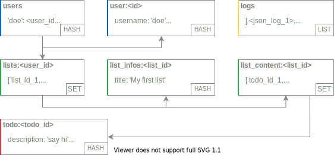

# To-do list app with Flask, Redis & VueJS.

A to-do app allowing user authentication and to-dos managements secured by JWT and deployable with Docker.

Deploy with `docker-compose -f docker-compose.yml up`, the JWT secret can be set in the `docker_compose.yml` file.

The API runs on port 8000 and the static frontend is served on the default http port, 80.

## API: Flask + Redis 

The API is vanilla Flask app with the dependencies kept as short a possible, it is divided like so:
- **blueprints**: Each blueprint correspond to a family of routes (`/lists`, `/todos`, `/auth` and `/logger`).
- **static** & **templates**: This is only used to serve Swagger UI (v44) that act as an interactive documentation (route `/doc`).
- **test**: A suite of tests running with `pytest`, covering the use cases of the API.
- **utils**: Contains the decorators (to request authentication, auto logs) and the `marshmallow` schemas used to validate the input to some routes.

For the Docker deployment the app is served through Gunicorn, a production friendly WSGI.

### Database structure

## Front: VueJS

The front is a static responsive VueJS app with the following routes:
- **/**: The Home page with all the lists on the left side and a main panel with the to-dos of the selected list (empty, because no list is selected).
- **/:id**: Same thing, except the id corresponds to the currently selected list, and the main panel is then filled with the to-dos of the list `id`.
- **/login**: The login page
- **/signup**: The register page (uses the same component as the login page)
- **/logs**: Public logs of everything that happens on the API in near real time.

For the Docker deployment the app is served through Nginx, a config file `nginx.conf` has been added to avoid unnatural 404 errors caused by the usage of History Mode for Vue's router.

To change the API url before deployment, just edit the `VUE_APP_SERVER` build arg in the docker-compose.yml file.